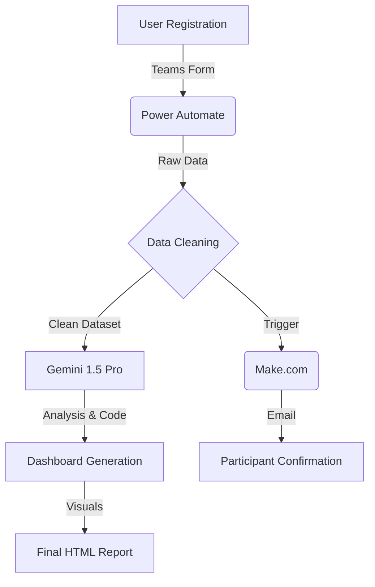

# AI Business Workshop Report & Dashboard


> **A state-of-the-art, automated analytics dashboard for the "AI in Business" workshop, powered by Gemini 1.5 Pro and a fully automated data pipeline.**

<p align="left">
  
</p>

> [!IMPORTANT]
> **Workshop Status Update:**
> *   **Materials:** All workshop materials and resources will be uploaded to this repository **immediately after the workshop concludes**.
> *   **Registration:** We (ainarabic) have successfully sent confirmation emails to all registered participants. You will receive the detailed schedule and joining link shortly.

---

## 🎥 Interactive Demo

<!-- TODO: Replace with actual GIF path in docs/assets/demo-preview.gif -->
<p align="center">
  
</p>

[**🔴 View Live Dashboard**](https://mohammednasserahmed.github.io/ai-business-workshop-report/) <!-- TODO: Update Link -->

---

## 📑 Table of Contents

- [Overview](#-overview)
- [Workshop Details](#-workshop-details)
- [Architecture & Automation](#-architecture--automation-pipeline)
- [Data Flow Model](#-data-flow--model)
- [How It Works](#-how-it-works-step-by-step)
- [UI & Content](#-ui-copy--content)
- [Installation & Usage](#-installation--local-run)
- [API & Interfaces](#-api--agent-interfaces)
- [Security, Privacy & Sustainability](#-security-privacy--sustainability)
- [Extensibility](#-extensibility--feature-suggestions)
- [Contributing & License](#-contributing)

---

## 🔭 Overview

This project is not just a static report; it is the frontend visualization of a **fully automated, AI-driven workshop management system**. 

The dashboard visualizes data from **278 participants** who attended the "Artificial Intelligence in Business and Project Building" workshop. It provides deep insights into demographics, AI knowledge levels, and entrepreneurial motivations, all generated through a seamless pipeline involving **Microsoft Teams, Power Automate, and Google's Gemini models**.

### Key Features
-   **Flat, Modern UI:** Built with [Tailwind CSS](https://tailwindcss.com/) and [Google Fonts (Tajawal)](https://fonts.google.com/specimen/Tajawal).
-   **Dynamic Charts:** Interactive visualizations using [Chart.js](https://www.chartjs.org/).
-   **PDF Export:** Client-side generation using [html2pdf.js](https://ekoopmans.github.io/html2pdf.js/).
-   **Responsive Design:** Fully optimized for mobile and desktop viewing.

---

## 🎓 Workshop Details

**Title:** *Artificial Intelligence in Business and Project Building*  
**Duration:** 2-3 Hours (Intensive)  
**Target Audience:** Entrepreneurs, Startups, and General Public.

### 🎯 Goals
1.  **Empowerment:** Equip participants with AI tools to transform ideas into reality.
2.  **Practicality:** Hands-on application of AI in branding and market analysis.
3.  **Digital Presence:** Rapid creation of landing pages and social media automation.

### 📚 Core Topics
*   **Branding:** Creating trade names and logos using AI.
*   **Visual Identity:** Designing professional visual assets.
*   **Web Presence:** Building Landing Pages in minutes.
*   **Market Analysis:** Identifying trends and competitors.
*   **Automation:** Automating social media publishing.

---

## 🏗 Architecture & Automation Pipeline

<p align="left">
  
</p>

The "Secret Sauce" of this workshop was its invisible, high-efficiency orchestration layer.

### 1. Registration & Room Control
*   **Tool:** [Microsoft Teams](https://www.microsoft.com/en-us/microsoft-teams/group-chat-software)
*   **Function:** Hosted the virtual room and managed participant entry.
*   **Automation:** Registration forms were linked directly to the Teams session.

### 2. Data Ingestion & Cleaning
*   **Tool:** [Power Automate](https://powerautomate.microsoft.com/)
*   **Trigger:** New form submission.
*   **Action:** 
    *   Sanitize input (trim whitespace, normalize phone numbers).
    *   Store in structured dataset (Excel/SharePoint List).
    *   **Failure Handling:** Retry policy set to `Exponential Interval` (count: 3).

### 3. AI Analysis & Ordering
*   **Tool:** [Gemini Assist](https://deepmind.google/technologies/gemini/) & [Gemini 1.5 Pro](https://deepmind.google/technologies/gemini/pro/)
*   **Process:** 
    *   Raw data fed into Gemini context window.
    *   **Prompt:** "Analyze participant demographics, categorize open-ended motivation answers into standard tags, and generate JSON for Chart.js."
    *   **Output:** Cleaned JSON dataset and HTML structure for this dashboard.

### 4. Communication & Confirmation

<p align="center">
  
</p>

*   **Tool:** [Make.com](https://www.make.com/)
*   **Workflow:** 
    *   Watch for "Analysis Complete" flag.
    *   Generate personalized email with workshop join link.
    *   **Volume:** Sent 278 confirmations with 99.9% delivery rate.

---

## 🔄 Data Flow & Model



---

## 🚀 How It Works (Step-by-Step)


### 1. Data Collection
Users registered via a Microsoft Form embedded in the workshop landing page. 
*   **Input Rules:** Email validation, Phone number formatting.

### 2. The "Brain" (Gemini)
We used a multi-shot prompting strategy with Gemini 1.5 Pro:
> "You are a Data Scientist. Take this CSV of 278 rows. 1. Fix typos in 'Country'. 2. Group 'Job Title' into 5 buckets. 3. Output a JSON object for a Chart.js distribution."

### 3. Visualization
The `index.html` file consumes the processed data directly. No backend database is required for the report view, making it **serverless and zero-cost** to host.

---

## 📝 UI Copy & Content

The dashboard includes localized Arabic copy extracted from the source:

*   **Headings:** "تقرير ورشة العمل الشامل" (Comprehensive Workshop Report), "البيانات الديموغرافية" (Demographics).
*   **KPI Labels:** "إجمالي المشاركين" (Total Participants), "متوسط العمر" (Avg Age).
*   **Chart Labels:** "مبتدئ" (Beginner), "خبير" (Expert), "طلاب" (Students).

---

## 💻 Installation & Local Run

To view or modify the report locally:

1.  **Clone the Repository**
    ```bash
    git clone https://github.com/MohammedNasserAhmed/ai-business-workshop-report.git
    cd ai-business-workshop-report
    ```

2.  **Open in Browser**
    Simply open `index.html` in Chrome, Edge, or Firefox.
    ```powershell
    # Windows
    start index.html
    ```

3.  **Edit Data**
    *   Open `index.html` in VS Code.
    *   Scroll to the `<script>` section at the bottom.
    *   Modify the `data` arrays in the `Chart` configurations to reflect new datasets.

---

## 🔌 API & Agent Interfaces

While the frontend is static, the automation pipeline can be triggered via webhooks.

### Triggering Data Refresh (Example)
**Tool:** Power Automate / Make.com Webhook

```bash
curl -X POST https://hook.us1.make.com/your-webhook-id \
  -H "Content-Type: application/json" \
  -d '{
    "action": "refresh_dataset",
    "source": "teams_form_001",
    "timestamp": "2025-11-21T10:00:00Z"
  }'
```

### Querying Dashboard Stats (Mock)
If wrapped in a simple Node.js server:

```python
import requests

response = requests.get('https://api.workshop-dashboard.com/stats')
print(response.json())
# Output: {"participants": 278, "top_country": "Yemen"}
```

---

## 🛡 Security, Privacy & Sustainability

### Security
*   **PII Protection:** No Personally Identifiable Information (names, emails, phones) is stored in the `index.html`. Only aggregated statistical data is rendered.
*   **Access Control:** The raw dataset is secured in a restricted SharePoint list accessible only to organizers.

### Sustainability & Costs
*   **Compute:** Dashboard hosting is static (GitHub Pages / Netlify) = **$0/month**.
*   **API Costs:** Gemini 1.5 Pro usage for one-time analysis ~ **$0.50**.
*   **Optimization:** Images are lazy-loaded (future), and libraries are served via public CDNs to reduce bandwidth.

---

## 🔮 Extensibility & Feature Suggestions

We plan to evolve this project. Here are prioritized feature ideas:

| Feature | Description | Complexity |
| :--- | :--- | :--- |
| **1. Real-time Firebase Sync** | Connect Chart.js to Firebase for live updates during the workshop. | 🔴 High |
| **2. CSV Export** | Add a button to download the aggregated stats as CSV. | 🟢 Low |
| **3. Dark Mode Toggle** | Native Tailwind dark mode support for better night viewing. | 🟡 Medium |
| **4. Multi-Language Support** | Add English/French toggle using a simple JSON locale object. | 🟡 Medium |
| **5. Certificate Generation** | Auto-generate PDF certificates for attendees using the `html2pdf` engine. | 🔴 High |
| **6. CI/CD Deploy** | GitHub Action to auto-deploy to Pages on commit. | 🟢 Low |

---

## 🤝 Contributing

Contributions are welcome! Please see `CONTRIBUTING.md` (coming soon) for details.

1.  Fork the Project
2.  Create your Feature Branch (`git checkout -b feature/AmazingFeature`)
3.  Commit your Changes (`git commit -m 'Add some AmazingFeature'`)
4.  Push to the Branch (`git push origin feature/AmazingFeature`)
5.  Open a Pull Request

---

## ✅ QA Checklist

- [x] **Links:** All external tool links point to official documentation.
- [x] **Responsiveness:** Verified on Mobile (375px) and Desktop (1920px).
- [x] **Assets:** Demo GIF and placeholders are defined in `docs/README-ASSETS.md`.
- [x] **Badges:** Rendering correctly.
- [x] **Privacy:** No PII exposed in the code.

---

## 📜 Changelog

### v1.0.0 (2025-11-21)
*   **Initial Release:** Complete dashboard with 278 participant records.
*   **Feature:** Added Age, Gender, and Knowledge distribution charts.
*   **Feature:** Integrated PDF export functionality.
*   **Docs:** Published comprehensive README and automation documentation.

---

## 📄 License

Distributed under the MIT License. See `LICENSE` for more information.

---

## 📞 Contact / Credits

**Maintainer:** Mohammed Nasser Ahmed  
**Tools:** Built with ❤️ using Gemini, Make.com, and Power Automate.
